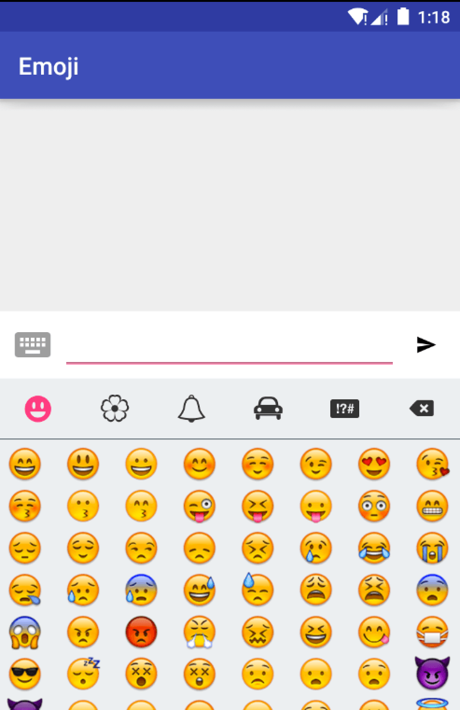

# Emoji

[](https://travis-ci.org/vanniktech/Emoji?branch=master)
[](https://android-arsenal.com/details/1/3287)
[](http://www.apache.org/licenses/LICENSE-2.0.html)

A simple library to add Emoji support to your Android app. In a PopupWindow Emojis can be chosen. In order to edit and display text with Emojis this library provides public APIs: [`EmojiEditText`](library/src/main/java/com/vanniktech/emoji/EmojiEditText.java) & [`EmojiTextView`](library/src/main/java/com/vanniktech/emoji/EmojiTextView.java).

The library has 2 different providers to choose from.

## iOS Emojis




For getting the above iOS Emojis simply add the dependency and code below.

```groovy
compile 'com.vanniktech:emoji-ios:0.4.0'
```

```java
EmojiManager.install(new IosEmojiProvider()); // This line needs to be executed before any usage of EmojiTextView or EmojiEditText.
```

## EmojiOne


For getting the above EmojiOne Emojis simply add the dependency and code below.

```groovy
compile 'com.vanniktech:emoji-one:0.4.0'
```

```java
EmojiManager.install(new EmojiOneProvider()); // This line needs to be executed before any usage of EmojiTextView or EmojiEditText.
```

### Custom Emojis

If you want to display your own Emojis you can create your own implementation of [`EmojiProvider`](library/src/main/java/com/vanniktech/emoji/EmojiProvider.java) and pass it to `EmojiManager.install`.

All of the core API lays in:

```groovy
compile 'com.vanniktech:emoji:0.4.0'
```

### Inserting Emojis

Declare your [`EmojiEditText`](library/src/main/java/com/vanniktech/emoji/EmojiEditText.java) in your layout xml file.

```xml
<com.vanniktech.emoji.EmojiEditText
  android:id="@+id/emojiEditText"
  android:layout_width="match_parent"
  android:layout_height="wrap_content"
  android:imeOptions="actionSend"
  android:inputType="textCapSentences|textMultiLine"
  android:maxLines="3"
  app:emojiSize="26sp"/>
```

To open the [`EmojiPopup`](library/src/main/java/com/vanniktech/emoji/EmojiPopup.java) execute the code below:

```java
final EmojiPopup emojiPopup = EmojiPopup.Builder.fromRootView(rootView).build(emojiEditText);
emojiPopup.toggle(); // Toggles visibility of the Popup.
emojiPopup.dismiss(); // Dismisses the Popup.
emojiPopup.isShowing(); // Returns true when Popup is showing.
```

The `rootView` is the rootView of your layout xml file which will be used for calculating the height of the keyboard.
`emojiEditText` is the [`EmojiEditText`](library/src/main/java/com/vanniktech/emoji/EmojiEditText.java) that you declared in your layout xml file.

### Displaying Emojis

```xml
<com.vanniktech.emoji.EmojiTextView
  android:id="@+id/emojiTextView"
  android:layout_width="wrap_content"
  android:layout_height="wrap_content"/>
```

Just use the [`EmojiTextView`](library/src/main/java/com/vanniktech/emoji/EmojiTextView.java) and call `setText` with the String that contains Unicode encoded Emojis.

## Listeners

The [`EmojiPopup`](library/src/main/java/com/vanniktech/emoji/EmojiPopup.java) builder allows you to declare several listeners.

```java
setOnSoftKeyboardCloseListener(OnSoftKeyboardCloseListener listener);
setOnEmojiClickedListener(OnEmojiClickedListener listener);
setOnSoftKeyboardOpenListener(OnSoftKeyboardOpenListener listener);
setOnEmojiPopupShownListener(OnEmojiPopupShownListener listener);
setOnEmojiPopupDismissListener(OnEmojiPopupDismissListener listener);
setOnEmojiBackspaceClickListener(OnEmojiBackspaceClickListener listener);
```

### Custom recent Emoji implementation

You can pass your own implementation of the recent Emojis. Just let one of your classes implement the [`RecentEmoji`](library/src/main/java/com/vanniktech/emoji/RecentEmoji.java) interface and pass it when you're building the [`EmojiPopup`](library/src/main/java/com/vanniktech/emoji/EmojiPopup.java):

```java
setRecentEmoji(yourClassThatImplementsRecentEmoji)
```

If no instance or a null instance is set the default implementation will be used.

Check out the sample project to get more information.

# Proguard

No configuration needed.

# License

Copyright (C) 2016 Vanniktech - Niklas Baudy

Licensed under the Apache License, Version 2.0