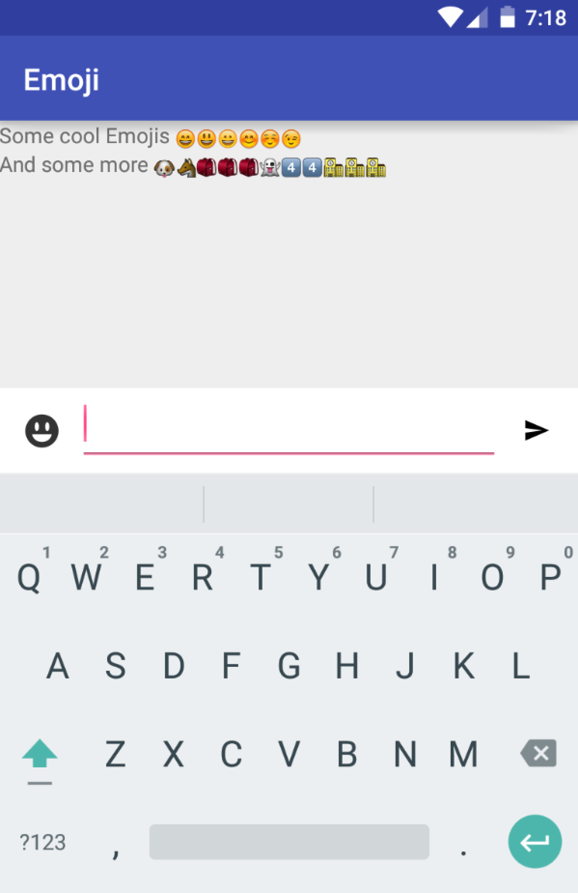
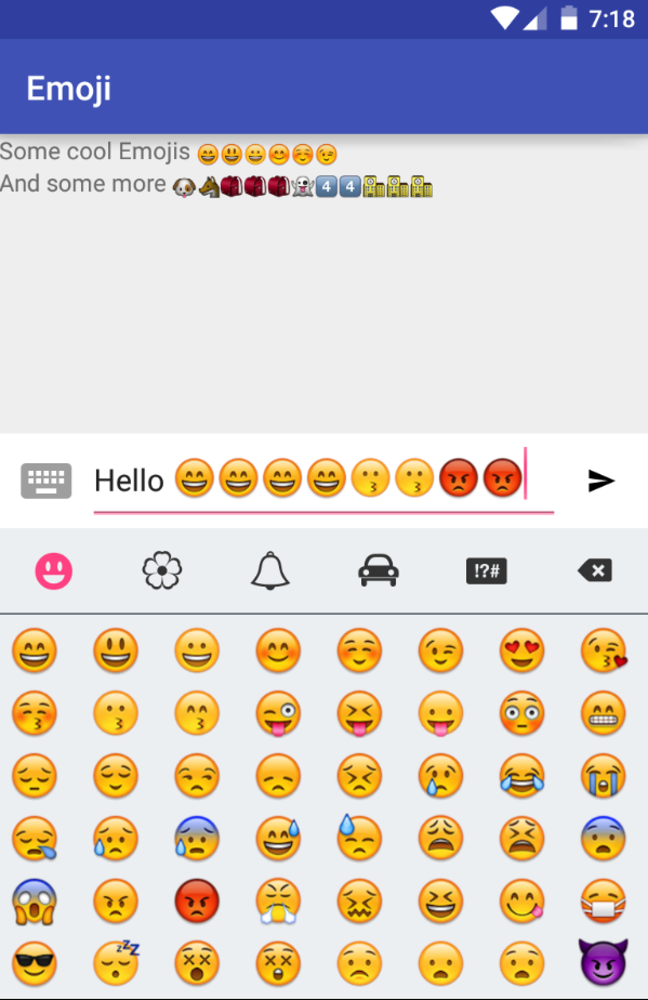

# Emoji

[](https://travis-ci.org/vanniktech/Emoji?branch=master)
[](https://android-arsenal.com/details/1/3287)
[](http://www.apache.org/licenses/LICENSE-2.0.html)

A simple library to add Emoji support to your Android Application. In a PopupWindow Emojis can be chosen. In order to edit and display text with Emojis this library provides public APIs: [`EmojiEditText`](library/src/main/java/com/vanniktech/emoji/EmojiEditText.java) & [`EmojiTextView`](library/src/main/java/com/vanniktech/emoji/EmojiTextView.java).




# Setup

**build.gradle**

```groovy
compile 'com.vanniktech:emoji:0.1.0'
compile 'com.vanniktech:emoji:0.2.0-SNAPSHOT'
```

Modules are located on [Maven Central](https://oss.sonatype.org/#nexus-search;gav~com.vanniktech~emoji~~~).

# Example

```xml
<com.vanniktech.emoji.EmojiEditText
    android:id="@+id/emojiEditText"
    android:layout_width="match_parent"
    android:layout_height="wrap_content"
    android:imeOptions="actionSend"
    android:inputType="textCapSentences|textMultiLine"
    android:maxLines="3"
    app:emojiSize="26sp"/>
```

```java
final EmojiPopup emojiPopup = EmojiPopup.Builder.fromRootView(rootView).build(emojiEditText);
emojiPopup.toggle(); // Toggles visibility of the Popup
emojiPopup.dismiss(); // Dismisses the Popup
emojiPopup.isShowing(); // Returns true when Popup is showing
```

The `rootView` is the rootView of your layout xml file which will be used for calculating the height of the keyboard.
`emojiEditText` is the [`EmojiEditText`](library/src/main/java/com/vanniktech/emoji/EmojiEditText.java) that you declared in your layout xml file.

## Listeners

On the builder for the `EmojiPopup` you are able to declare several listeners.

```java
setOnSoftKeyboardCloseListener(final OnSoftKeyboardCloseListener listener);
setOnEmojiClickedListener(final OnEmojiClickedListener listener);
setOnSoftKeyboardOpenListener(final OnSoftKeyboardOpenListener listener);
setOnEmojiPopupShownListener(final OnEmojiPopupShownListener listener);
setOnEmojiPopupDismissListener(final OnEmojiPopupDismissListener listener);
setOnEmojiBackspaceClickListener(final OnEmojiBackspaceClickListener listener);
```

## Displaying Emojis

```xml
<com.vanniktech.emoji.EmojiTextView
    android:id="@+id/emojiTextView"
    android:layout_width="wrap_content"
    android:layout_height="wrap_content"/>
```

Just use the [`EmojiTextView`](library/src/main/java/com/vanniktech/emoji/EmojiTextView.java) and call `setText` with the String you got from [`EmojiEditText`](library/src/main/java/com/vanniktech/emoji/EmojiEditText.java) and you're done.

Check out the sample project to get more information.

# Proguard

No configuration needed.

# License

Copyright (C) 2016 Vanniktech - Niklas Baudy

Licensed under the Apache License, Version 2.0